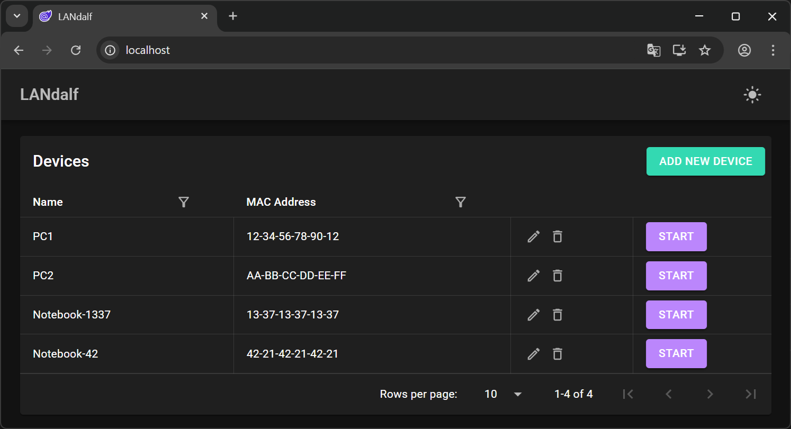

<div align="center">

# 🧙‍♂️ LANdalf

### *"You Shall Not Sleep!"*

**A Modern Wake-on-LAN Management Platform**

[](https://github.com/renedierking/LANdalf/releases)
[](https://github.com/renedierking/LANdalf/actions/workflows/build-and-test.yml)
[](https://dotnet.microsoft.com/)
[](https://dotnet.microsoft.com/apps/aspnet/web-apps/blazor)
[](https://opensource.org/licenses/MIT)
[](https://www.docker.com/)

[Features](#-features) • [Quick Start](#-quick-start) • [Docs](#-documentation) • [Contributing](#-contributing)

</div>

---

## 📖 About

LANdalf is a web-based Wake-on-LAN management platform built with .NET 10.0, Blazor WebAssembly, and MudBlazor. It lets you manage network devices and wake them remotely — deployable in seconds via Docker Compose.

## ✨ Features

- **Device Management** — Add, edit, and organize network devices with MAC address storage
- **Wake-on-LAN** — Send magic packets to wake sleeping devices remotely
- **RESTful API** — Versioned API with OpenAPI documentation ([API Guide](docs/API_USAGE.md))
- **Docker Ready** — One-command deployment, cross-platform (Windows, Linux, macOS)

## Interface Preview



## 🚀 Quick Start

Create a `docker-compose.yaml`:

<!-- BEGIN_DOCKER_COMPOSE -->
```yaml
services:
  api:
    image: ghcr.io/renedierking/landalf-api:latest
    container_name: landalf-api
    network_mode: host
    environment:
      - ASPNETCORE_URLS=http://+:5000
      - Cors__FrontendUrl=http://localhost # Adjust if NGINX_PORT != 80, e.g. http://localhost:8080
      - Serilog__MinimumLevel__Default=Information
      - Serilog__MinimumLevel__Override__Microsoft.AspNetCore=Warning
      - Serilog__MinimumLevel__Override__Microsoft.EntityFrameworkCore=Warning
    volumes:
      - api-data:/app/LANdalf_Data
      - api-logs:/app/logs
    restart: unless-stopped

  ui:
    image: ghcr.io/renedierking/landalf-ui:latest
    container_name: landalf-ui
    network_mode: host
    environment:
      - NGINX_PORT=80 # Change to any free port, then update Cors__FrontendUrl above
    depends_on:
      - api
    restart: unless-stopped
volumes:
  api-data:
  api-logs:
```
<!-- END_DOCKER_COMPOSE -->

```bash
docker compose up -d
```

- **UI**: http://localhost
- **API**: http://localhost:5000
- **API Docs**: http://localhost:5000/scalar/v1

> **Custom UI port:** Set `NGINX_PORT` (e.g. `8080`) and update `Cors__FrontendUrl` accordingly (e.g. `http://localhost:8080`).

> For manual setup, platform-specific instructions, and troubleshooting, see the **[Installation Guide](docs/INSTALLATION.md)**.

## 📚 Documentation

| Guide | Description |
|-------|-------------|
| 🚀 **[Installation & Setup](docs/INSTALLATION.md)** | Docker & manual installation, configuration, troubleshooting |
| 🔧 **[Wake-on-LAN Setup](docs/WOL_SETUP.md)** | Device configuration, network setup, testing WoL |
| 📡 **[API Usage Guide](docs/API_USAGE.md)** | API reference, examples, error handling |
| 🏗️ **[Architecture](ARCHITECTURE.md)** | System design, tech stack, data flow, database schema |
| 🗺️ **[Roadmap](ROADMAP.md)** | Planned features and enhancements |

## 🛠️ Development

```bash
dotnet build LANdalf.slnx   # Build
dotnet test                  # Test
docker compose build         # Docker images
```

See **[CONTRIBUTING.md](CONTRIBUTING.md)** for prerequisites, project structure, and development guidelines.

## 🤝 Contributing

Contributions are welcome! Please read the **[Contributing Guide](CONTRIBUTING.md)** for the workflow and guidelines.

## 📄 License

MIT — see [LICENSE](LICENSE) for details.

## 📞 Support

- [GitHub Issues](https://github.com/renedierking/LANdalf/issues) · [GitHub Discussions](https://github.com/renedierking/LANdalf/discussions)

---

<div align="center">

Made with ❤️ by [renedierking](https://github.com/renedierking)

**If you find LANdalf helpful, please consider giving it a ⭐!**

</div>
